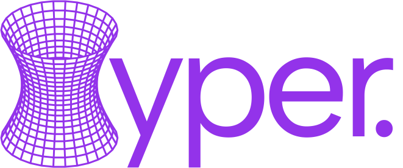

[![Contributors][contributors-shield]][contributors-url]
[![Forks][forks-shield]][forks-url]
[![Stargazers][stars-shield]][stars-url]
[![Issues][issues-shield]][issues-url]
[![License][license-shield]][license-url]

<!-- PROJECT LOGO -->
 

  
  

     
    A Non-Euclidean Rendering Engine.
  

---

**Hyper** is an experimental rendering engine exploring non-Euclidean spaces.  
It starts with the **Poincaré disk (2D)** and evolves into a **hybrid 3D engine** where X and Y are hyperbolic, while Z
remains Euclidean.

## Overview and Objectives

This project is a 3D rendering engine using [ray-casting](https://en.wikipedia.org/wiki/Ray_casting) to navigate an
infinite maze within a [hyperbolic world](https://en.wikipedia.org/wiki/Hyperbolic_geometry), visualized through the
[Poincaré disk model](https://en.wikipedia.org/wiki/Poincar%C3%A9_disk_model). Rather than a mere puzzle, it serves as
an educational tool—an interactive tutorial on non-Euclidean spaces,
[hyperbolic tiling](http://aleph0.clarku.edu/~djoyce/poincare/poincare.html), and maze algorithms, brought to
life with videos and animations to make abstract concepts accessible.

## Table of Contents

| Chapter | Title|
|---------|----------------------------------------------|
| I.A | [How to Run the Project](docs/running-the-project.md) |
| II.A | [Introduction](docs/I/introduction.md)         |
| II.B | [Basic Mathematics in the Poincaré Disk Model](docs/I/basic-mathematics-in-the-poincare-disk-model.md) |
| II.C | [Isometries](docs/I/isometries.md)

## Licence

See all about our license [here](/LICENCE)

## Contributors

[contributors-shield]: https://img.shields.io/github/contributors/cocosol007/hyper.svg?style=for-the-badge

[contributors-url]: https://github.com/cocosol007/hyper/graphs/contributors

[forks-shield]: https://img.shields.io/github/forks/cocosol007/hyper.svg?style=for-the-badge

[forks-url]: https://github.com/cocosol007/hyper/network/members

[stars-shield]: https://img.shields.io/github/stars/cocosol007/hyper.svg?style=for-the-badge

[stars-url]: https://github.com/cocosol007/hyper/stargazers

[issues-shield]: https://img.shields.io/github/issues/cocosol007/hyper.svg?style=for-the-badge

[issues-url]: https://github.com/cocosol007/hyper/issues

[license-shield]: https://img.shields.io/github/license/cocosol007/hyper.svg?style=for-the-badge

[license-url]: https://github.com/cocosol007/hyper/blob/main/LICENCE
